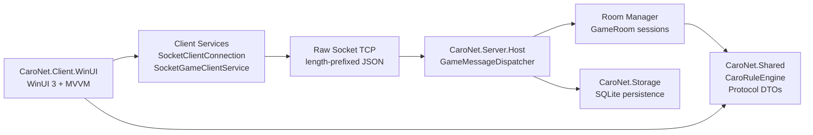
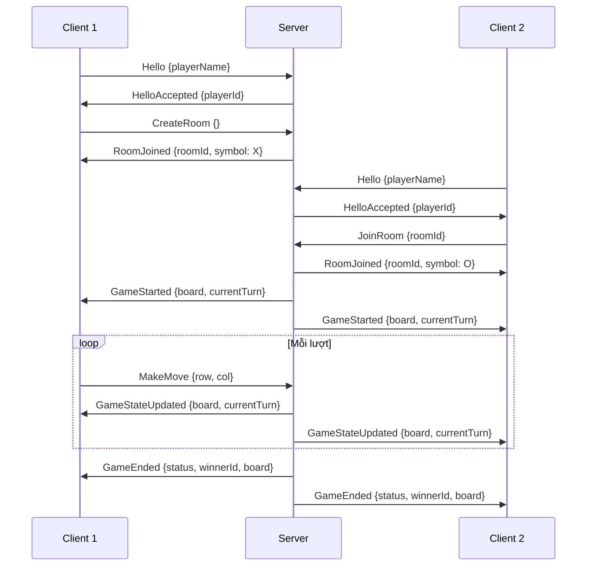

# CaroNet

CaroNet là project môn Lập trình mạng: game cờ Caro desktop 1v1 theo mô hình client-server. Mục tiêu chính là thể hiện phần networking rõ ràng: client gửi yêu cầu, server giữ trạng thái thật của phòng/ván đấu, kiểm tra lượt đi, broadcast trạng thái mới và xử lý lỗi kết nối cơ bản.

Project dùng C#, .NET 10 LTS, WinUI 3 / Windows App SDK, raw `System.Net.Sockets.Socket`, JSON length-prefix framing và SQLite. Đây là project học phần, nên kiến trúc được giữ vừa đủ gọn để làm demo được, nhưng vẫn tách ranh giới để mở rộng sau này.

## Trạng thái hiện tại

### Đã hoàn thành ✅

- [x] Solution structure: client WinUI, server host, shared library, storage, test project
- [x] Rule engine Caro 20×20: thắng 5 quân liên tiếp (4 hướng)
- [x] Raw TCP server/client bằng `System.Net.Sockets.Socket` (async I/O)
- [x] Protocol: JSON length-prefix framing (4 bytes big-endian + UTF-8)
- [x] Server: message dispatcher, tạo/join phòng, validate nước đi, broadcast state
- [x] WinUI 3 MVVM: MainMenuPage, GamePage, bàn cờ hiển thị X/O
- [x] SQLite lưu lịch sử trận đấu và thống kê người chơi
- [x] Unit test: rule engine, protocol parser, payload serialization
- [x] Demo 2 client chơi hết 1 ván qua TCP trên cùng máy

### Đang phát triển 🚧

| Issue | Tính năng | Assignee | Trạng thái |
|-------|-----------|----------|------------|
| [#38](../../issues/38) | Chat trong phòng chơi | @phucnh8317-coder | Open |
| [#39](../../issues/39) | Header tên đối thủ + score | @tannd2333 | Open |
| [#40](../../issues/40) | Dialog thắng/thua/hòa | @TrongNhan0510 | Open |
| [#41](../../issues/41) | Xử lý disconnect đối thủ | @NguyenDucThanh123 | Open |
| [#42](../../issues/42) | UI lịch sử trận đấu | @Baong123 | Open |
| [#43](../../issues/43) | Turn Indicator UX | @tannd2333 | Open |
| [#44](../../issues/44) | Move Timer 30s | @NguyenDucThanh123 | Open |
| [#45](../../issues/45) | Lưu tên người chơi | @phucnh8317-coder | Open |
| [#46](../../issues/46) | Nút chơi lại (Rematch) | @TrongNhan0510 | Open |
| [#47](../../issues/47) | README + tài liệu vấn đáp | @Chouwzi | Open |
| [#48](../../issues/48) | Highlight đường thắng | @TrongNhan0510 | Open |

## Stack

| Lớp | Công nghệ | Ghi chú |
| --- | --- | --- |
| Client UI | WinUI 3 / Windows App SDK | Ứng dụng desktop Windows cho người chơi |
| Client pattern | MVVM | `GameViewModel` bind trực tiếp với `GamePage` |
| Server | .NET console/host process | Host phòng, quản lý client, phòng và log |
| Network | `System.Net.Sockets.Socket` | Dùng low-level socket thay vì `TcpListener`/`TcpClient` |
| Protocol | JSON + length-prefix framing | 4 bytes big-endian length + UTF-8 JSON body |
| Storage | SQLite via Dapper | Lưu lịch sử trận và thống kê người chơi |
| Test | xUnit | Rule engine, protocol parser, payload serialization |

## Kiến trúc



### Protocol flow



Nguyên tắc quan trọng:

- Server là nguồn dữ liệu chính của trận đấu.
- Client chỉ gửi request và hiển thị state đã được server xác nhận.
- Luật Caro, DTO và protocol nằm trong `CaroNet.Shared` để client/server không copy logic.
- Storage tách riêng để sau này có thể đổi SQLite hoặc thêm repository thật mà không làm bẩn server/client.
- Network code dùng async I/O, cancellation token và log lỗi parse/disconnect.

## Cấu trúc thư mục

```text
CaroNet/
  README.md

  Code/
    CaroNet.slnx

    src/
      CaroNet.Client.WinUI/
        Assets/
        Controls/
        Services/        → SocketClientConnection, SocketGameClientService
        ViewModels/       → GameViewModel, GameViewState
        Views/            → MainMenuPage, GamePage
        App.xaml
        Package.appxmanifest

      CaroNet.Server.Host/
        GameRooms/        → GameRoom, RoomManager
        Networking/       → SocketServer, ClientSession, LengthPrefixFrameCodec
        Services/         → GameMessageDispatcher
        Program.cs

      CaroNet.Shared/
        Game/             → CaroGameState, CaroRuleEngine, BoardPosition, CellState
        Models/
        Protocol/         → MessageType, MessageEnvelope, Payloads/

      CaroNet.Storage/
        Matches/          → IMatchHistoryStore, SqliteMatchHistoryStore
        Profiles/         → IPlayerRecordStore, SqlitePlayerRecordStore

    tests/
      CaroNet.Shared.Tests/
        PayloadSerializationTests.cs
        RuleEngineTests.cs

    docs/
      architecture.md
      protocol.md
      test-plan.md
```

## Cách chạy

Yêu cầu:

- Windows 10 version 1809 trở lên hoặc Windows 11.
- .NET 10 SDK.
- Visual Studio có workload .NET desktop development và Windows App SDK/WinUI.

### Build & Test

```powershell
dotnet restore .\Code\CaroNet.slnx
dotnet build .\Code\CaroNet.slnx -c Debug -p:Platform=x64
dotnet test .\Code\CaroNet.slnx -c Debug -p:Platform=x64
```

### Chạy Server

```powershell
dotnet run --project .\Code\src\CaroNet.Server.Host\CaroNet.Server.Host.csproj
```

Server sẽ listen trên port mặc định và chờ client kết nối.

### Chạy Client WinUI

1. Mở `Code/CaroNet.slnx` bằng Visual Studio.
2. Chọn startup project `CaroNet.Client.WinUI`.
3. Chọn platform `x64`.
4. Run bằng Visual Studio (F5) để dùng đúng tooling WinUI/MSIX.
5. Nhập tên người chơi, IP server, port → nhấn Connect.
6. Tạo phòng hoặc nhập Room ID để join.

### Demo nhanh (2 client cùng máy)

1. Chạy Server.
2. Mở 2 instance Visual Studio hoặc deploy client ra 2 cửa sổ.
3. Client 1: Connect → Create Room → copy Room ID.
4. Client 2: Connect → paste Room ID → Join Room.
5. Chơi xen kẽ lượt cho đến khi có kết quả.

## Protocol

TCP là byte stream, nên mỗi message phải có framing. CaroNet dùng:

```text
[4 bytes length, big-endian][UTF-8 JSON payload]
```

Envelope JSON:

```json
{
  "type": "MakeMove",
  "requestId": "b6b4a4b4-62e9-4c46-81c4-9f1d61a1a1a1",
  "roomId": "room-001",
  "playerId": "player-001",
  "payload": {
    "row": 7,
    "column": 8
  }
}
```

### Message types đã implement

Client → Server:

- [x] `Hello` — Gửi tên người chơi khi kết nối.
- [x] `CreateRoom` — Tạo phòng mới.
- [x] `JoinRoom` — Tham gia phòng theo Room ID.
- [x] `Ready` — Sẵn sàng chơi.
- [x] `MakeMove` — Đánh nước đi tại vị trí (row, col).
- [ ] `Chat` — Gửi tin nhắn trong phòng.
- [ ] `Heartbeat` — Giữ kết nối.
- [ ] `Reconnect` — Kết nối lại phiên đang chơi.

Server → Client:

- [x] `HelloAccepted` — Xác nhận kết nối, trả playerId.
- [x] `RoomListUpdated` — Cập nhật danh sách phòng.
- [x] `RoomJoined` — Xác nhận đã vào phòng, trả symbol (X/O).
- [x] `GameStarted` — Game bắt đầu, trả board và lượt đi đầu.
- [x] `MoveAccepted` — Nước đi hợp lệ.
- [x] `MoveRejected` — Nước đi bị từ chối (sai lượt/ô đã có/out of bounds).
- [x] `GameStateUpdated` — Board + lượt đi hiện tại sau mỗi nước.
- [x] `GameEnded` — Kết quả: XWon/OWon/Draw, winnerId, board.
- [ ] `ChatReceived` — Nhận tin nhắn chat.
- [x] `Error` — Thông báo lỗi.

Chi tiết trong [Code/docs/protocol.md](Code/docs/protocol.md).

## Checklist tính năng

### Game core

- [x] Bàn cờ 20×20.
- [x] Người chơi X/O đánh theo lượt.
- [x] Kiểm tra thắng 5 quân liên tiếp (4 hướng).
- [x] Từ chối nước đi ngoài bàn, ô đã có quân hoặc sai lượt.
- [ ] Reset/chơi lại sau khi kết thúc → [#46](../../issues/46)
- [ ] Highlight đường thắng → [#48](../../issues/48)
- [ ] Giới hạn thời gian mỗi lượt → [#44](../../issues/44)

### Network

- [x] TCP server bằng raw `Socket`.
- [x] TCP client bằng raw `Socket`.
- [x] Length-prefix frame reader/writer.
- [x] Serialize/deserialize JSON bằng `System.Text.Json`.
- [x] Message dispatcher ở server.
- [x] Tạo phòng, join phòng.
- [x] Broadcast state sau mỗi nước đi hợp lệ.
- [ ] Chat trong phòng → [#38](../../issues/38)
- [ ] Heartbeat.
- [ ] Disconnect handling → [#41](../../issues/41)
- [ ] Reconnect ngắn hạn.

### UI/UX

- [x] Màn hình nhập tên người chơi + server host/port.
- [x] Bàn cờ Caro 20×20 với hiển thị X/O rõ ràng.
- [x] Trạng thái kết nối hiển thị real-time.
- [x] Thông báo lỗi từ server.
- [ ] Header tên đối thủ + score → [#39](../../issues/39)
- [ ] Turn Indicator rõ ràng → [#43](../../issues/43)
- [ ] Dialog kết quả thắng/thua/hòa → [#40](../../issues/40)
- [ ] Panel chat hoạt động → [#38](../../issues/38)
- [ ] Lưu tên người chơi khi vào lại app → [#45](../../issues/45)

### Data

- [x] SQLite match history storage.
- [x] SQLite player record storage.
- [ ] UI xem lịch sử trận → [#42](../../issues/42)
- [ ] Lưu cấu hình server gần đây → [#45](../../issues/45)

### Quality

- [x] Unit test cho rule engine (thắng/thua/hòa/nước đi không hợp lệ).
- [x] Unit test cho protocol frame parser.
- [x] Unit test cho payload serialization (JSON round-trip).
- [x] Test thủ công 2 client trên cùng máy.
- [x] Log lỗi network, parse message và state sync.

## Phân công nhóm & Đóng góp (Contribution Matrix)

Chi tiết phân công công việc, mã hóa nhánh, mã hóa issue và phần trăm đóng góp của các thành viên trong nhóm:

| Thành viên | Vai trò & Mảng chính | Issues đảm nhiệm | Nhánh (Branch) chính | Đóng góp (%) |
|---|---|---|---|---|
| **Nguyễn Trần Đình Chương**<br>(@Chouwzi) | **Leader**<br>- Thiết kế kiến trúc tổng thể, thiết lập CI/CD pipeline và review PR.<br>- Xử lý lỗi đồng thời/race conditions, vá lỗi bảo mật (OutOfMemory #61, Rate Limiting #53). | [#47](../../issues/47), [#53](../../issues/53), [#61](../../issues/61), [#64](../../issues/64) | `develop`, `main`, `feature/61-53-security-fixes`, `feature/64-fix-room-race-condition`, `docs/47-qa-readme-update` | **35%** |
| **Nguyễn Đức Thành**<br>(@NguyenDucThanh123) | **Protocol & Server Infra**<br>- Định nghĩa cấu trúc protocol envelope JSON.<br>- Xây dựng bộ mã hóa/giải mã length-prefix và hạ tầng Socket Server. | [#41](../../issues/41), [#44](../../issues/44) | `feature/3-protocol-codec`, `feature/4-socket-server` | **15%** |
| **Bao Nguyễn Trường**<br>(@Baong123) | **Storage & UI History**<br>- Thiết kế database SQLite, Dapper repositories lưu lịch sử và thống kê.<br>- Xây dựng trang giao diện Lịch sử trận đấu trong WinUI. | [#42](../../issues/42) | `feature/7-match-history-storage`, `feature/17-history-and-records-db`, `feature/42-match-history-ui` | **15%** |
| **Nguyễn Hoàng Phúc**<br>(@phucnh8317-coder) | **Client Net & UI Chat**<br>- Xây dựng Client Socket receive loop bất đồng bộ và cơ chế event.<br>- Wiring tính năng chat room và lưu trữ thiết lập cấu hình client. | [#38](../../issues/38), [#45](../../issues/45) | `feature/5-client-network`, `feature/38-room-chat`, `feature/45-persist-player-settings` | **15%** |
| **Nguyễn Duy Tân**<br>(@tannd2333) | **UI Contract & Turn Indicator**<br>- Thiết kế giao diện Menu chính, bàn cờ Caro 20x20.<br>- Thực hiện cơ chế Turn Indicator UX (chỉ báo lượt đi). | [#39](../../issues/39), [#43](../../issues/43) | `feature/6-minimal-playable-match-screen`, `feature/43-turn-indicator` | **10%** |
| **Trọng Nhân**<br>(@TrongNhan0510) | **Game Logic & Dialogs**<br>- Phát triển Caro Rule Engine (kiểm tra thắng/thua 5 quân liên tiếp).<br>- Tạo dialog thông báo kết quả ván đấu (Win/Loss/Draw). | [#40](../../issues/40), [#46](../../issues/46), [#48](../../issues/48) | `feature/caro-game-logic` | **10%** |

* **Tài liệu câu hỏi ôn tập vấn đáp:** Nhóm đã chuẩn bị sẵn tài liệu ôn tập câu hỏi vấn đáp mẫu chi tiết cho từng thành viên (5 câu/người) tại: [Tài liệu ôn tập vấn đáp](Code/docs/qa-vandap.md).

## Quy ước phát triển

- Namespace đi theo folder, ví dụ `CaroNet.Shared.Protocol`.
- Mặc định để type là `internal`, chỉ `public` khi project khác cần dùng.
- Không để UI gọi socket trực tiếp; UI đi qua ViewModel/Service.
- Không để client tự quyết thắng thua; server xác nhận kết quả.
- Một socket chỉ nên có một receive loop và một send queue/loop để tránh interleaving khi gửi nhiều message.
- Logic dễ test như rule engine/protocol parser phải nằm ngoài WinUI.

### Git workflow

- **Gitflow**: `main` (stable) ← `develop` (integration) ← `feature/*`, `fix/*`, `docs/*` branches.
- Mỗi tính năng tạo branch từ `develop`, PR vào `develop`, sau đó PR `develop` → `main`.
- Branch naming: `feature/{issue-number}-{short-description}`, `fix/{issue-number}-{description}`, `docs/{issue-number}-{description}`.
- Commit message: `feat:`, `fix:`, `docs:`, `test:`, `refactor:` prefix.
