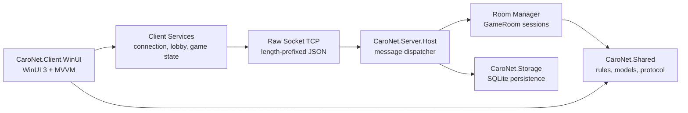

# CaroNet

CaroNet là project môn Lập trình mạng: game cờ Caro desktop 1v1 theo mô hình client-server. Mục tiêu chính là thể hiện phần networking rõ ràng: client gửi yêu cầu, server giữ trạng thái thật của phòng/ván đấu, kiểm tra lượt đi, broadcast trạng thái mới và xử lý lỗi kết nối cơ bản.

Project dự kiến dùng C#, .NET 10 LTS, WinUI 3 / Windows App SDK, raw `System.Net.Sockets.Socket`, JSON length-prefix framing và SQLite. Đây là project học phần, nên kiến trúc được giữ vừa đủ gọn để làm demo được, nhưng vẫn tách ranh giới để mở rộng sau này.

## Trạng thái hiện tại

- [x] Tạo `.gitignore` cho .NET / Visual Studio / WinUI / MSIX.
- [x] Sắp xếp solution theo yêu cầu môn học: code nằm trong `Code/`, tài liệu nằm trong `docs/`.
- [x] Tách project nền: client WinUI, server host, shared library, storage library.
- [x] Thêm test project ban đầu cho `CaroNet.Shared`.
- [ ] Hiện thực rule engine Caro.
- [ ] Hiện thực raw socket server/client.
- [ ] Hoàn thiện protocol v1.
- [ ] Hoàn thiện UI lobby, phòng chờ, bàn cờ và chat.

## Stack

| Lớp | Công nghệ | Ghi chú |
| --- | --- | --- |
| Client UI | WinUI 3 / Windows App SDK | Ứng dụng desktop Windows cho người chơi |
| Client pattern | MVVM | Dự kiến dùng `CommunityToolkit.Mvvm` khi bắt đầu UI logic |
| Server | .NET console/host process | Host phòng, quản lý client, phòng và log |
| Network | `System.Net.Sockets.Socket` | Dùng low-level socket thay vì `TcpListener`/`TcpClient` |
| Protocol | JSON + length-prefix framing | Dễ debug, phân tách message rõ trên TCP stream |
| Storage | SQLite | Lưu profile cục bộ, lịch sử trận, leaderboard đơn giản |
| Test | xUnit | Ưu tiên rule engine, protocol parser và room state |

## Kiến trúc



Nguyên tắc quan trọng:

- Server là nguồn dữ liệu chính của trận đấu.
- Client chỉ gửi request và hiển thị state đã được server xác nhận.
- Luật Caro, DTO và protocol nằm trong `CaroNet.Shared` để client/server không copy logic.
- Storage tách riêng để sau này có thể đổi SQLite hoặc thêm repository thật mà không làm bẩn server/client.
- Network code dùng async I/O, cancellation token, heartbeat và log lỗi parse/disconnect.

## Cấu trúc thư mục

```text
CaroNet/
  README.md

  Code/
    CaroNet.slnx

    src/
      CaroNet.Client.WinUI/
        Assets/
        Controls/
        Services/
        ViewModels/
        Views/
        App.xaml
        Package.appxmanifest

      CaroNet.Server.Host/
        GameRooms/
        Networking/
        Services/
        Program.cs

      CaroNet.Shared/
        Game/
        Models/
        Protocol/

      CaroNet.Storage/
        Matches/
        Profiles/

    tests/
      CaroNet.Shared.Tests/

  docs/
    architecture.md
    protocol.md
    test-plan.md
    sprints/
```

## Cách chạy

Yêu cầu:

- Windows 10 version 1809 trở lên hoặc Windows 11.
- .NET 10 SDK.
- Visual Studio có workload .NET desktop development và Windows App SDK/WinUI.

Restore, build và test:

```powershell
dotnet restore .\Code\CaroNet.slnx
dotnet build .\Code\CaroNet.slnx -c Debug -p:Platform=x64
dotnet test .\Code\CaroNet.slnx -c Debug -p:Platform=x64
```

Chạy server host skeleton:

```powershell
dotnet run --project .\Code\src\CaroNet.Server.Host\CaroNet.Server.Host.csproj
```

Chạy WinUI client:

1. Mở `Code/CaroNet.slnx` bằng Visual Studio.
2. Chọn startup project `CaroNet.Client.WinUI`.
3. Chọn platform `x64`.
4. Run bằng Visual Studio để dùng đúng tooling WinUI/MSIX.

## Protocol định hướng

TCP là byte stream, nên mỗi message phải có framing. CaroNet dùng hướng:

```text
[4 bytes length, big-endian][UTF-8 JSON payload]
```

Envelope JSON dự kiến:

```json
{
  "type": "MakeMove",
  "requestId": "b6b4a4b4-62e9-4c46-81c4-9f1d61a1a1a1",
  "roomId": "room-001",
  "playerId": "player-001",
  "payload": {
    "row": 7,
    "column": 8
  }
}
```

Message nhóm chính:

- [ ] `Hello`
- [ ] `CreateRoom`
- [ ] `JoinRoom`
- [ ] `Ready`
- [ ] `MakeMove`
- [ ] `Chat`
- [ ] `Heartbeat`
- [ ] `Reconnect`
- [ ] `Error`

Chi tiết sẽ được cập nhật trong [docs/protocol.md](docs/protocol.md).

## Checklist tính năng

Game core:

- [ ] Bàn cờ 15x15 hoặc 20x20.
- [ ] Người chơi X/O đánh theo lượt.
- [ ] Kiểm tra thắng 5 quân liên tiếp.
- [ ] Từ chối nước đi ngoài bàn, ô đã có quân hoặc sai lượt.
- [ ] Reset/chơi lại sau khi kết thúc.
- [ ] Mở rộng: luật chặn hai đầu.
- [ ] Mở rộng: giới hạn thời gian mỗi lượt.

Network:

- [ ] TCP server bằng raw `Socket`.
- [ ] TCP client bằng raw `Socket`.
- [ ] Length-prefix frame reader/writer.
- [ ] Serialize/deserialize JSON bằng `System.Text.Json`.
- [ ] Message dispatcher ở server.
- [ ] Tạo phòng, join phòng, rời phòng.
- [ ] Broadcast state sau mỗi nước đi hợp lệ.
- [ ] Chat trong phòng.
- [ ] Heartbeat.
- [ ] Disconnect handling.
- [ ] Reconnect ngắn hạn.
- [ ] Mở rộng: UDP LAN discovery.

UI/UX:

- [ ] Màn hình nhập tên người chơi.
- [ ] Lobby danh sách phòng.
- [ ] Màn hình phòng chờ.
- [ ] Bàn cờ Caro.
- [ ] Panel chat.
- [ ] Trạng thái kết nối.
- [ ] Thông báo lỗi dễ hiểu.
- [ ] Mở rộng: theme sáng/tối.

Data:

- [ ] Lưu profile cục bộ.
- [ ] Lưu lịch sử trận.
- [ ] Lưu cấu hình server gần đây.
- [ ] Mở rộng: leaderboard.
- [ ] Mở rộng: replay/export match log.

Quality:

- [ ] Unit test cho rule engine.
- [ ] Unit test cho protocol frame parser.
- [ ] Unit test cho room/game state.
- [ ] Test thủ công 2 client trên cùng máy.
- [ ] Test thủ công 2 máy trong LAN.
- [ ] Log lỗi network, parse message và state sync.
- [ ] GitHub milestone theo 4 sprint.

## Sprint plan

Sprint 1 - nền tảng:

- [ ] Setup solution và project structure.
- [ ] Rule engine cơ bản.
- [ ] WinUI shell.
- [ ] Protocol v1 draft.
- [ ] Server host skeleton.
- [ ] Unit test thắng/thua/hòa cơ bản.

Sprint 2 - chơi qua TCP cơ bản:

- [ ] Raw socket accept/connect.
- [ ] JSON length-prefix framing.
- [ ] Create/join room.
- [ ] Đồng bộ lượt đánh.
- [ ] Server validate nước đi.
- [ ] Demo 2 client chơi hết một ván.

Sprint 3 - trải nghiệm mạng:

- [ ] Lobby room list.
- [ ] Chat.
- [ ] Heartbeat.
- [ ] Disconnect handling.
- [ ] SQLite match history.
- [ ] Mở rộng: UDP LAN discovery.

Sprint 4 - ổn định và demo:

- [ ] Reconnect ngắn hạn.
- [ ] Chỉnh UI.
- [ ] Test case cuối kỳ.
- [ ] Hướng dẫn chạy chi tiết.
- [ ] Release build.
- [ ] Script/video demo.

## Quy ước phát triển

- Namespace đi theo folder, ví dụ `CaroNet.Shared.Protocol`.
- Mặc định để type là `internal`, chỉ `public` khi project khác cần dùng.
- Không để UI gọi socket trực tiếp; UI đi qua ViewModel/Service.
- Không để client tự quyết thắng thua; server xác nhận kết quả.
- Một socket chỉ nên có một receive loop và một send queue/loop để tránh interleaving khi gửi nhiều message.
- Logic dễ test như rule engine/protocol parser phải nằm ngoài WinUI.
