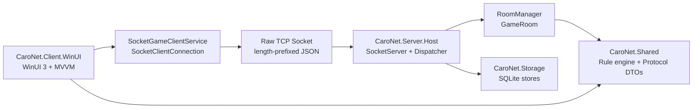
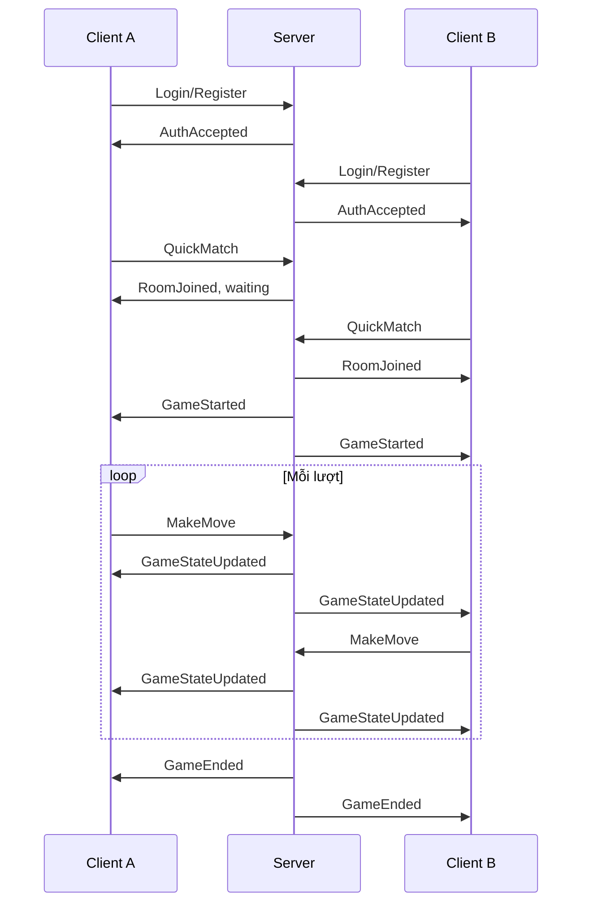

# CaroNet

CaroNet là đồ án môn Lập trình mạng: game cờ Caro desktop 1v1 theo mô hình client-server. Project tập trung thể hiện rõ phần networking: client gửi request, server giữ trạng thái thật của phòng/ván đấu, kiểm tra lượt đi, broadcast state mới, lưu lịch sử và xử lý các tình huống rời phòng/ngắt kết nối cơ bản.

Project dùng C#, .NET 10, WinUI 3 / Windows App SDK, raw `System.Net.Sockets.Socket`, JSON length-prefix framing và SQLite. Scope được giữ vừa đủ cho đồ án nhóm sinh viên, không triển khai theo hướng enterprise như token phiên dài hạn, phân quyền admin hay dịch vụ cloud.

## Trạng Thái

Các phần chính đã hoàn thiện:

- Client WinUI 3 với menu, đăng nhập/đăng ký, bàn cờ, chat, lịch sử và ranking.
- Server TCP socket quản lý session, phòng chơi, quick match, lượt đi và timeout.
- Protocol JSON length-prefix dùng chung giữa client/server qua `CaroNet.Shared`.
- Đăng ký/đăng nhập đơn giản bằng SQLite để có `UserId` ổn định.
- Chơi nhanh FIFO thread-safe: 2 client bấm chơi nhanh sẽ được ghép vào cùng phòng.
- Tạo phòng và vào phòng bằng mã phòng.
- Luật Caro 15x15, thắng khi có 5 quân liên tiếp theo 4 hướng.
- Chat trong phòng dạng bubble trái/phải, phân biệt tin mình, tin đối thủ và tin hệ thống.
- Quick actions trong ván: đầu hàng, xin hòa, chơi lại.
- Đồng hồ 30 giây mỗi lượt, xử lý timeout ở server.
- Popup kết quả có thể đóng để xem lại bàn cờ.
- Highlight nước vừa đi và đường thắng.
- Lịch sử trận đấu cá nhân chỉ hiển thị trận của tài khoản đang đăng nhập.
- Ranking Top 10 lấy từ thống kê người chơi trên server.
- Giao diện hỗ trợ light/dark theme bằng theme resource động.
- CI/CD GitHub Actions build và test trên pull request vào `develop`/`main`.

## Stack

| Lớp | Công nghệ | Ghi chú |
| --- | --- | --- |
| Client UI | WinUI 3 / Windows App SDK | Ứng dụng desktop Windows |
| Client pattern | MVVM | `GameViewModel`, `MainMenuViewModel`, `HistoryViewModel` |
| Server | .NET console host | Quản lý socket, session, phòng và dispatcher |
| Network | `System.Net.Sockets.Socket` | Raw TCP socket async I/O |
| Protocol | JSON + length-prefix framing | 4 bytes big-endian length + UTF-8 JSON body |
| Storage | SQLite | Users, matches, moves, player records |
| Test | xUnit | Shared, storage, server host, client service/viewmodel |
| CI/CD | GitHub Actions | Build/test solution trên Windows |

## Kiến Trúc



Nguyên tắc chính:

- Server là nguồn dữ liệu chính của trận đấu.
- Client chỉ gửi request và hiển thị state đã được server xác nhận.
- Client không tự quyết thắng/thua, timeout hay lịch sử.
- Protocol DTO và rule engine nằm trong `CaroNet.Shared` để không copy logic.
- Storage tách riêng để server không trộn SQL vào xử lý socket.
- UI không gọi socket trực tiếp, mà đi qua service và viewmodel.

## Cấu Trúc Thư Mục

```text
CaroNet/
  README.md
  .github/workflows/dotnet.yml

  Code/
    CaroNet.slnx

    src/
      CaroNet.Client.WinUI/
        Assets/
        Models/
        Services/        -> SocketClientConnection, SocketGameClientService
        ViewModels/      -> MainMenuViewModel, GameViewModel, HistoryViewModel
        Views/           -> MainMenuPage, GamePage, HistoryPage, BestRecordPage

      CaroNet.Server.Host/
        GameRooms/       -> GameRoom, RoomManager
        Networking/      -> SocketServer, ClientSession
        Services/        -> GameMessageDispatcher
        Program.cs

      CaroNet.Shared/
        Game/            -> CaroGameState, CaroRuleEngine, BoardPosition
        Protocol/        -> MessageType, MessageEnvelope, Payloads

      CaroNet.Storage/
        Database/        -> DatabaseInitializer, SqliteConnectionFactory
        Matches/         -> Match history stores
        Statistics/      -> Player record stores
        Users/           -> User account stores, password hasher

    tests/
      CaroNet.Client.WinUI.Tests/
      CaroNet.Server.Host.Tests/
      CaroNet.Shared.Tests/
      CaroNet.Storage.Tests/

    docs/
      architecture.md
      protocol.md
      storage.md
      test-plan.md
      qa-vandap.md
```

## Cách Chạy

Yêu cầu:

- Windows 10 version 1809 trở lên hoặc Windows 11.
- .NET 10 SDK.
- Visual Studio có workload .NET desktop development và Windows App SDK/WinUI.

### Build Và Test

```powershell
dotnet restore .\Code\CaroNet.slnx
dotnet build .\Code\CaroNet.slnx --configuration Debug -p:Platform=x64 --no-restore --verbosity minimal
dotnet test .\Code\CaroNet.slnx --configuration Debug -p:Platform=x64 --no-build --verbosity minimal
```

### Chạy Server

```powershell
dotnet run --project .\Code\src\CaroNet.Server.Host\CaroNet.Server.Host.csproj --configuration Debug
```

Server khởi tạo `caronet.db` nếu chưa có và listen port mặc định `5000`.

### Chạy Client

1. Mở `Code/CaroNet.slnx` bằng Visual Studio.
2. Chọn startup project `CaroNet.Client.WinUI`.
3. Chọn platform `x64`.
4. Run bằng Visual Studio hoặc chạy file exe đã build.
5. Đăng ký hoặc đăng nhập tài khoản.
6. Chọn `Chơi nhanh`, `Tạo phòng`, hoặc `Vào phòng`.

### Demo 2 Client Cùng Máy

1. Chạy server.
2. Mở 2 instance client.
3. Client A đăng nhập tài khoản A.
4. Client B đăng nhập tài khoản B.
5. Cả hai bấm `Chơi nhanh` để được ghép vào cùng phòng, hoặc một client tạo phòng và client còn lại nhập mã phòng.
6. Chơi đến khi thắng/thua/hòa.
7. Kiểm tra `Lịch sử trận đấu` của từng tài khoản và `Ranking Top 10`.

Lưu ý: client không lưu username/display name/password ở local settings để có thể test nhiều tài khoản trên cùng một máy.

## Protocol

TCP là byte stream, nên mỗi message dùng framing:

```text
[4 bytes length, big-endian][UTF-8 JSON payload]
```

Envelope JSON:

```json
{
  "type": "MakeMove",
  "roomId": "123456",
  "playerId": "4506a841-5078-4c1d-90c2-1f39943f4dc2",
  "payload": {
    "row": 7,
    "column": 8
  }
}
```

### Message Types Chính

Client -> Server:

- `Register`, `Login`
- `CreateRoom`, `JoinRoom`, `QuickMatch`, `LeaveRoom`
- `MakeMove`
- `Chat`
- `Resign`
- `DrawOffer`, `DrawResponse`
- `Rematch`
- `MyHistoryRequest`
- `TopRecordsRequest`

Server -> Client:

- `AuthAccepted`
- `RoomJoined`, `GameStarted`
- `MoveAccepted`, `MoveRejected`, `GameStateUpdated`
- `GameEnded`
- `ChatReceived`
- `RematchAccepted`
- `MyHistoryReceived`
- `TopRecordsReceived`
- `Error`

Chi tiết thêm trong [Code/docs/protocol.md](Code/docs/protocol.md).

## Luồng Chơi Chính



## Dữ Liệu SQLite

Các bảng chính:

- `Users`: tài khoản, display name và password hash.
- `Matches`: thông tin trận, người chơi X/O, winner, user id liên quan.
- `MatchMoves`: danh sách nước đi theo từng trận.
- `PlayerRecords`: thống kê thắng/thua/hòa cho Ranking Top 10.

Lịch sử cá nhân chỉ lấy các trận mới có `UserId`; dữ liệu cũ chưa có `UserId` không hiển thị trong lịch sử cá nhân.

## Kiểm Thử

Test tự động hiện bao phủ các nhóm chính:

- Rule engine Caro.
- Protocol framing và payload serialization.
- SQLite stores cho users, matches, player records.
- Server dispatcher: auth, quick match, leave room, resign/draw/rematch, history/ranking.
- Client service/viewmodel: login/register, quick match, history, ranking, state update.

Lệnh thường dùng:

```powershell
dotnet build .\Code\CaroNet.slnx --configuration Debug -p:Platform=x64 --no-restore --verbosity minimal
dotnet test .\Code\CaroNet.slnx --configuration Debug -p:Platform=x64 --no-build --verbosity minimal
```

## Quy Ước Phát Triển

- Gitflow: `main` là bản ổn định, `develop` là nhánh tích hợp.
- Tính năng/fix tạo từ `develop`, PR vào `develop`, sau đó release PR vào `main`.
- Branch naming: `feature/...`, `fix/...`, `docs/...`, `release/...`.
- Commit message dùng prefix rõ: `feat:`, `fix:`, `docs:`, `test:`, `refactor:`, `style:`.
- Không để UI gọi socket trực tiếp.
- Không để client tự quyết kết quả trận.
- Code comment dùng tiếng Việt có dấu, ngắn gọn và chỉ comment khi cần.

## Phân Công Nhóm

| Thành viên | Mảng chính |
| --- | --- |
| Nguyễn Trần Đình Chương (@Chouwzi) | Leader, kiến trúc tổng thể, CI/CD, review, hardening, auth/quick match/history/ranking |
| Nguyễn Đức Thành (@NguyenDucThanh123) | Protocol, server infra, disconnect, turn timer |
| Bao Nguyễn Trường (@Baong123) | SQLite storage, lịch sử trận đấu, thống kê |
| Nguyễn Hoàng Phúc (@phucnh8317-coder) | Client socket, chat, cấu hình client |
| Nguyễn Duy Tân (@tannd2333) | UI menu, game board, turn indicator |
| Trọng Nhân (@TrongNhan0510) | Rule engine, dialog kết quả, rematch, highlight thắng |

Tài liệu vấn đáp: [Code/docs/qa-vandap.md](Code/docs/qa-vandap.md).
